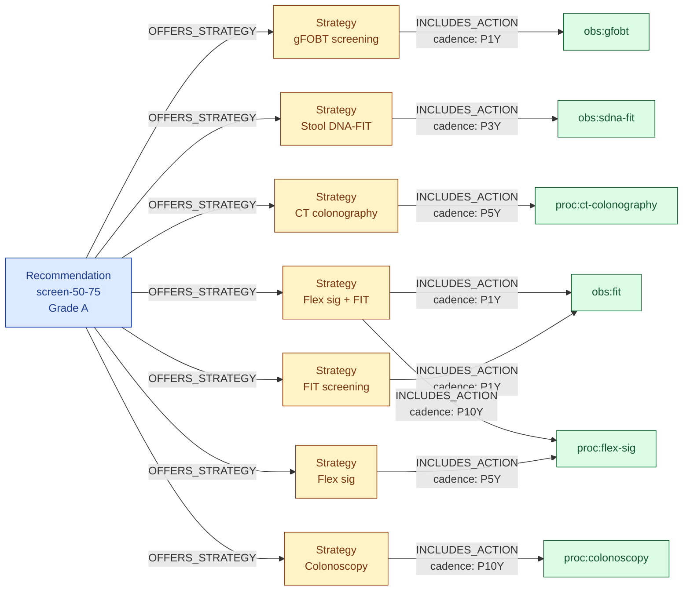
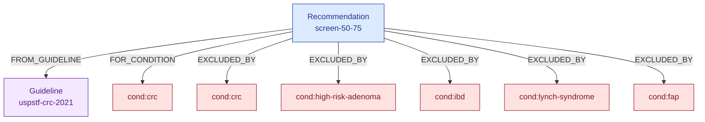
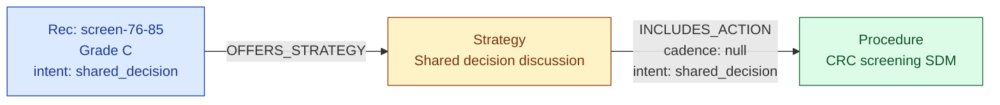
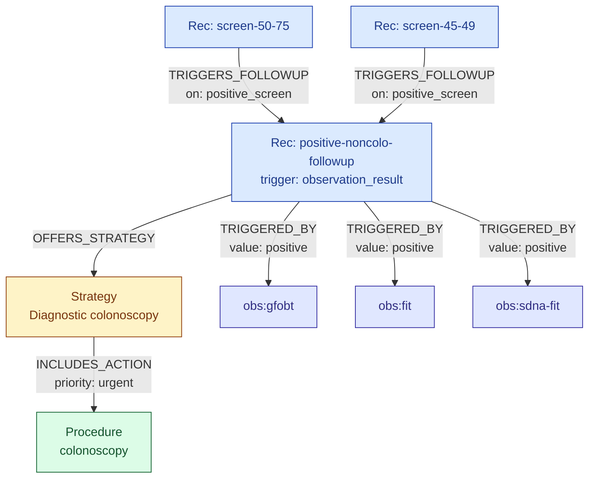
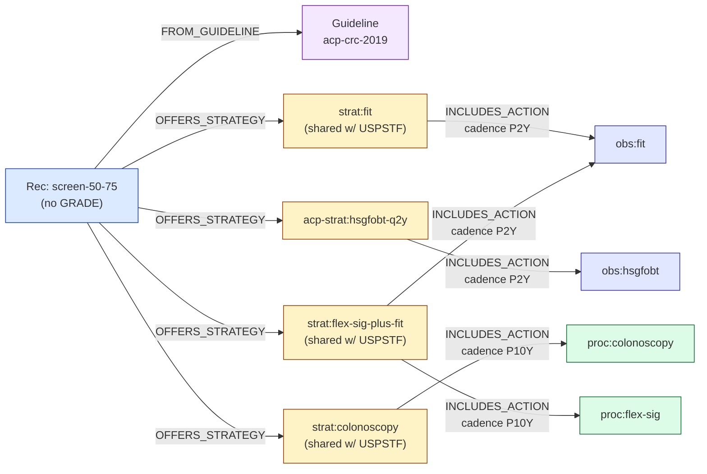
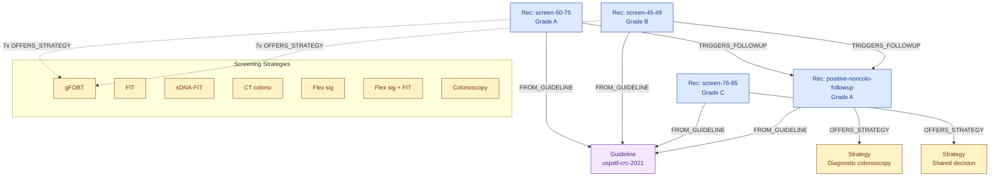

# CRC Screening — Graph Model Walkthrough

Concrete end-to-end model of the v0 CRC screening corpus: USPSTF 2021 (anchor) and ACP 2019 (sibling guidance). Used as a reference fixture and as the basis for v0 evals.

**Sources:** USPSTF 2021 CRC Screening Recommendation (effective 2021-05-18); ACP 2019 Guidance Statement (effective 2019-11-05). See `guideline-sources.md`.

## Contents

- [Guideline node](#guideline-node)
- [Clinical entity nodes (shared)](#clinical-entity-nodes-shared)
- [USPSTF 2021: Grade A (50-75)](#recommendation-grade-a-50-75)
- [USPSTF 2021: Grade B (45-49)](#recommendation-grade-b-45-49)
- [USPSTF 2021: Grade C (76-85)](#recommendation-grade-c-76-85)
- [USPSTF 2021: Positive non-colonoscopy followup](#recommendation-positive-non-colonoscopy-followup)
- [ACP 2019: Screen 50-75](#acp-2019-screen-50-75)
- [ACP 2019: Discontinue over 75](#acp-2019-discontinue-over-75)
- [USPSTF 2021 vs ACP 2019: side-by-side](#uspstf-2021-vs-acp-2019-side-by-side)
- [Full graph overview](#full-graph-overview)

## Guideline node

```yaml
Guideline:
  id: uspstf-crc-2021
  publisher: USPSTF
  version: "2021"
  effective_date: 2021-05-18
  url: https://www.uspreventiveservicestaskforce.org/uspstf/recommendation/colorectal-cancer-screening
  status: active
```

## Clinical entity nodes (shared)

These reference nodes are shared across all four CRC Recommendations.

### Conditions

```yaml
- id: cond:crc
  display_name: "Colorectal cancer"
  icd10_codes: [C18, C19, C20]
  snomed_codes: [363346000]

- id: cond:high-risk-adenoma
  display_name: "High-risk adenomatous polyps"
  snomed_codes: [428471009]

- id: cond:ibd
  display_name: "Inflammatory bowel disease"
  icd10_codes: [K50, K51]
  snomed_codes: [24526004, 34000006, 64766004]

- id: cond:lynch-syndrome
  display_name: "Lynch syndrome"
  icd10_codes: [Z15.09]
  snomed_codes: [315058005]

- id: cond:fap
  display_name: "Familial adenomatous polyposis"
  icd10_codes: [D12.6]
  snomed_codes: [72900001]
```

### Procedures

```yaml
- id: proc:colonoscopy
  display_name: "Colonoscopy"
  cpt_codes: ["45378"]
  snomed_codes: [73761001]

- id: proc:flex-sig
  display_name: "Flexible sigmoidoscopy"
  cpt_codes: ["45330"]
  snomed_codes: [44441009]

- id: proc:ct-colonography
  display_name: "CT colonography"
  cpt_codes: ["74263"]
  snomed_codes: [418714002]

- id: proc:crc-screening-shared-decision
  display_name: "CRC screening shared decision discussion"
  snomed_codes: [410225008]  # shared decision making (procedure)
```

### Observations

```yaml
- id: obs:gfobt
  display_name: "Guaiac fecal occult blood test"
  loinc_codes: ["12503-9"]

- id: obs:fit
  display_name: "Fecal immunochemical test"
  loinc_codes: ["57905-2"]

- id: obs:sdna-fit
  display_name: "Stool DNA-FIT (Cologuard)"
  loinc_codes: ["77353-1"]
```

## Recommendation: Grade A (50-75)

### Node

```yaml
Recommendation:
  id: uspstf-crc-2021-screen-50-75
  evidence_grade: A
  intent: screening
  trigger: patient_state
  source_section: "Recommendation Summary, Grade A"
  structured_eligibility:
    all_of:
      - { predicate: age_between, min: 50, max: 75 }
    none_of:
      - { predicate: has_condition_history, codes: [cond:crc, cond:high-risk-adenoma, cond:ibd, cond:lynch-syndrome, cond:fap] }
      # Strong family hx CRC, operational def (USMSTF/ACG-aligned; USPSTF 2021 defers): FDR <60 OR ≥2 FDRs.
      - { predicate: has_family_history_matching, relationship: [first_degree_relative], conditions: [cond:crc], onset_age_below: 60, min_count: 1 }
      - { predicate: has_family_history_matching, relationship: [first_degree_relative], conditions: [cond:crc], min_count: 2 }
      # Hereditary CRC syndrome in any relative (autosomal dominant risk extends beyond FDRs).
      - { predicate: has_family_history_matching, relationship: [any_relative], conditions: [cond:lynch-syndrome, cond:fap], min_count: 1 }
  clinical_nuance: |
    Any listed strategy is acceptable; there is no preferred approach. Modality
    choice should reflect patient preference, access, and prior screening history.
    Do not re-recommend a modality already satisfied within its cadence. If
    multiple modalities are overdue, propose the modality most consistent with
    patient history and practice availability. sDNA-FIT may be performed more
    frequently than every 3 years if clinically indicated.
```

### Strategies

```yaml
- id: strat:crc-gfobt-alone
  name: "gFOBT screening"

- id: strat:crc-fit-alone
  name: "FIT screening"

- id: strat:crc-sdna-fit-alone
  name: "Stool DNA-FIT screening"

- id: strat:crc-ct-colonography-alone
  name: "CT colonography screening"

- id: strat:crc-flex-sig-alone
  name: "Flexible sigmoidoscopy screening"

- id: strat:crc-flex-sig-plus-fit
  name: "Flexible sigmoidoscopy plus FIT screening"
  evidence_note: "Combined strategy improves sensitivity for right-sided lesions that flex sig alone misses."

- id: strat:crc-colonoscopy-alone
  name: "Colonoscopy screening"
```

### Strategy → action map

| Strategy | Action | cadence | lookback | expects |
|---|---|---|---|---|
| `crc-gfobt-alone` | `obs:gfobt` | P1Y | P1Y | negative |
| `crc-fit-alone` | `obs:fit` | P1Y | P1Y | negative |
| `crc-sdna-fit-alone` | `obs:sdna-fit` | P3Y | P3Y | negative |
| `crc-ct-colonography-alone` | `proc:ct-colonography` | P5Y | P5Y | — |
| `crc-flex-sig-alone` | `proc:flex-sig` | P5Y | P5Y | — |
| `crc-flex-sig-plus-fit` | `proc:flex-sig` | P10Y | P10Y | — |
| `crc-flex-sig-plus-fit` | `obs:fit` | P1Y | P1Y | negative |
| `crc-colonoscopy-alone` | `proc:colonoscopy` | P10Y | P10Y | — |

All edges carry `priority: routine`, `intent: screening`. `expects: negative` on stool-observation edges means the Strategy is satisfied only if a negative result exists within `lookback`; a positive FIT in the same window leaves the Strategy unsatisfied and fires the diagnostic-followup Rec via `TRIGGERED_BY` (see the positive-followup section). Procedure edges (`—`) have no `expects` in v0; presence within `lookback` satisfies. Procedure-result expectations (e.g., colonoscopy-with-no-high-risk-findings routing to surveillance) are deferred to USMSTF ingestion per the schema note.

### Visual: strategies and actions



Note the combined strategy `S6` has two `INCLUDES_ACTION` edges — both must be satisfied for that strategy to count. `A2` (FIT) is reused across the standalone FIT strategy and the combined strategy.

### Visual: exclusions and provenance



Strong-family-history and hereditary-syndrome-in-family exclusions live in `structured_eligibility` JSON only, no materialized edge. They evaluate against structured `FamilyMemberHistory` records in the patient context (see `patient-context.md`) via the `has_family_history_matching` predicate; there's no coded entity on the graph side to point an `EXCLUDED_BY` edge at.

## Recommendation: Grade B (45-49)

Structurally identical to Grade A except for age band and grade. **All seven Strategies are the same nodes, reused by OFFERS_STRATEGY edges from this Rec.** No duplication of Strategy nodes or action edges.

```yaml
Recommendation:
  id: uspstf-crc-2021-screen-45-49
  evidence_grade: B
  intent: screening
  trigger: patient_state
  source_section: "Recommendation Summary, Grade B"
  structured_eligibility:
    all_of:
      - { predicate: age_between, min: 45, max: 49 }
    none_of:
      # Same exclusions as Grade A
      - { predicate: has_condition_history, codes: [cond:crc, cond:high-risk-adenoma, cond:ibd, cond:lynch-syndrome, cond:fap] }
      - { predicate: has_family_history_matching, relationship: [first_degree_relative], conditions: [cond:crc], onset_age_below: 60, min_count: 1 }
      - { predicate: has_family_history_matching, relationship: [first_degree_relative], conditions: [cond:crc], min_count: 2 }
      - { predicate: has_family_history_matching, relationship: [any_relative], conditions: [cond:lynch-syndrome, cond:fap], min_count: 1 }
  clinical_nuance: |
    Evidence for net benefit in 45-49 is moderate (Grade B). Counsel patients
    that screening at this age is reasonable though the incremental benefit
    is smaller than at 50+. All strategies acceptable for Grade A are
    acceptable here.
```

**Edges from Grade B Rec:**
- `FROM_GUIDELINE` → `uspstf-crc-2021`
- `FOR_CONDITION` → `cond:crc`
- `EXCLUDED_BY` → five Condition nodes (same as Grade A)
- `OFFERS_STRATEGY` → seven existing Strategy nodes (same as Grade A)

### Visual

```mermaid
graph LR
  RA["Rec: screen-50-75<br/>Grade A"]
  RB["Rec: screen-45-49<br/>Grade B"]

  subgraph Strategies (shared)
    S1["gFOBT"]
    S2["FIT"]
    S3["sDNA-FIT"]
    S4["CT colono"]
    S5["Flex sig"]
    S6["Flex sig + FIT"]
    S7["Colonoscopy"]
  end

  RA -->|OFFERS_STRATEGY| S1
  RA -->|OFFERS_STRATEGY| S2
  RA -->|OFFERS_STRATEGY| S3
  RA -->|OFFERS_STRATEGY| S4
  RA -->|OFFERS_STRATEGY| S5
  RA -->|OFFERS_STRATEGY| S6
  RA -->|OFFERS_STRATEGY| S7

  RB -->|OFFERS_STRATEGY| S1
  RB -->|OFFERS_STRATEGY| S2
  RB -->|OFFERS_STRATEGY| S3
  RB -->|OFFERS_STRATEGY| S4
  RB -->|OFFERS_STRATEGY| S5
  RB -->|OFFERS_STRATEGY| S6
  RB -->|OFFERS_STRATEGY| S7

  classDef rec fill:#dbeafe,stroke:#1e40af,color:#1e3a8a
  classDef strat fill:#fef3c7,stroke:#92400e,color:#78350f
  class RA,RB rec
  class S1,S2,S3,S4,S5,S6,S7 strat
```

**Why this works cleanly:** Strategy nodes are reusable by construction. Any future age-band change or additional age-specific Rec reuses these seven Strategies. That's the payoff for factoring Strategy as its own node.

## Recommendation: Grade C (76-85)

This is the awkward one. USPSTF says: *selectively offer* screening based on patient's overall health, prior screening history, and preferences. The "action" is fundamentally a shared decision conversation, not a screening procedure.

### Node

```yaml
Recommendation:
  id: uspstf-crc-2021-screen-76-85
  evidence_grade: C
  intent: shared_decision
  trigger: patient_state
  source_section: "Recommendation Summary, Grade C"
  structured_eligibility:
    all_of:
      - { predicate: age_between, min: 76, max: 85 }
    none_of:
      - { predicate: has_condition_history, codes: [cond:crc, cond:high-risk-adenoma, cond:ibd, cond:lynch-syndrome, cond:fap] }
      - { predicate: has_family_history_matching, relationship: [first_degree_relative], conditions: [cond:crc], onset_age_below: 60, min_count: 1 }
      - { predicate: has_family_history_matching, relationship: [first_degree_relative], conditions: [cond:crc], min_count: 2 }
      - { predicate: has_family_history_matching, relationship: [any_relative], conditions: [cond:lynch-syndrome, cond:fap], min_count: 1 }
  clinical_nuance: |
    Do NOT routinely screen. Selectively offer screening based on:
      - patient's overall health and competing life expectancy
      - prior screening history (patients never previously screened are more
        likely to benefit than those with long history of normal screens)
      - patient values and preferences regarding screening and potential treatment
    If shared decision concludes screening is appropriate, any Grade A/B strategy
    is acceptable. If the patient is frail or has limited life expectancy (<10y),
    screening should not be offered. Avoid initiating screening in patients never
    screened at 85+ regardless of other factors.
```

### Strategies

```yaml
- id: strat:crc-shared-decision-76-85
  name: "CRC screening shared decision discussion"
  evidence_note: "Grade C individualized decision. If decision is to screen, reference Grade A/B strategies for modality."
```

**Only one Strategy, with one action:** the shared-decision Procedure.

```yaml
(strat:crc-shared-decision-76-85) -[:INCLUDES_ACTION {
  cadence: null,  # one-shot per age-band entry; not a recurring action
  lookback: null,
  priority: routine,
  intent: shared_decision
}]-> (proc:crc-screening-shared-decision)
```

### Visual



### Things to notice

- **The "action" is a conversation, not a procedure.** Modeled as a `Procedure` node coded with SNOMED `410225008` (shared decision making). No new node type needed; the counseling convention holds up.
- **Cadence is null.** Shared decisions aren't recurring in the same sense — they're triggered by the patient entering this age band, and satisfied once the discussion is documented.
- **If the discussion concludes "yes, screen,"** the agent acts on Grade A/B strategies via clinical nuance. The graph doesn't need a `TRIGGERS_FOLLOWUP` edge because there's no deterministic follow-up — the SDM outcome is a judgment call that routes back to the existing screening recs via the agent's reasoning, not the graph.
- **Heavy nuance-to-structure ratio.** Grade C pushes most content into `clinical_nuance`. This is expected for shared-decision recs and is the correct split per the schema convention.

## Recommendation: Positive non-colonoscopy followup

Separate Rec; fires on a stool-based or imaging-based screen result with a positive value.

### Node

```yaml
Recommendation:
  id: uspstf-crc-2021-positive-noncolo-followup
  evidence_grade: A
  intent: diagnostic
  trigger: observation_result
  trigger_criteria:
    any_of:
      - { observation: obs:gfobt, value: positive, window: P30D }
      - { observation: obs:fit, value: positive, window: P30D }
      - { observation: obs:sdna-fit, value: positive, window: P30D }
    # CT colonography positive is also a trigger but represented in clinical_nuance
    # for v0; we can model CT findings as discrete Observations in a future iteration
  source_section: "Clinical Considerations, Screening Test Follow-up"
  structured_eligibility:
    none_of:
      - { predicate: has_active_condition, codes: [cond:crc] }
      - { predicate: has_procedure_in_window, code: proc:colonoscopy, window: P90D }
  clinical_nuance: |
    A positive stool-based or imaging-based screening test requires diagnostic
    colonoscopy to complete screening. Repeat stool testing is NOT an appropriate
    follow-up. Target colonoscopy within 30-60 days of the positive result.
    If the patient declines diagnostic colonoscopy, document shared decision
    and revisit at next encounter.
```

### Strategies

```yaml
- id: strat:crc-diagnostic-colonoscopy
  name: "Diagnostic colonoscopy"
```

```yaml
(strat:crc-diagnostic-colonoscopy) -[:INCLUDES_ACTION {
  cadence: null,
  lookback: null,
  priority: urgent,
  intent: diagnostic
}]-> (proc:colonoscopy)
```

### Trigger edges and cascade

The followup Rec is *triggered by* three Observation nodes (via `TRIGGERED_BY` edges with per-observation criteria). The three screening Recs point at the followup via `TRIGGERS_FOLLOWUP` edges so the cascade is visible in the graph for the review tool and impact analysis.

### Visual: the full cascade chain



### Things to notice

- **No `TRIGGERED_BY` edge for colonoscopy-positive results.** A positive colonoscopy finding (adenoma, cancer) would route to surveillance or treatment guidelines that are out of scope for USPSTF 2021 and this v0 corpus.
- **`TRIGGERS_FOLLOWUP` is redundant with `TRIGGERED_BY` for firing.** The followup Rec would fire on a positive FIT regardless of whether the `TRIGGERS_FOLLOWUP` edge exists, because `TRIGGERED_BY` on the followup matches the event. We keep `TRIGGERS_FOLLOWUP` anyway for graph traversability ("show me everything downstream of the 50-75 screening rec") and for review-tool visualization.
- **`EXCLUDED_BY` for active CRC.** If the patient already has a CRC diagnosis, a positive FIT does not trigger a diagnostic workup — they're in treatment. Modeled via `structured_eligibility` and a materialized `EXCLUDED_BY` edge.
- **Stool-based screening Strategies carry `expects: negative` on their `INCLUDES_ACTION` edges.** A FIT performed in P1Y alone does not satisfy `crc-fit-alone`; a **negative** FIT does. A positive FIT leaves the screening Strategy unsatisfied (so the patient stays "due" for screening) and independently fires this followup Rec via the `TRIGGERED_BY` edge on `obs:fit`. The two behaviors use the same value vocabulary (`negative` / `positive`) by design.
- **Diagnostic colonoscopy after FIT+ satisfies screening by coded presence, not by intent.** A completed diagnostic colonoscopy leaves a CPT 45378 record that the screening Strategy `crc-colonoscopy-alone` reads as satisfying its P10Y lookback on `proc:colonoscopy`. The intent labels don't match but the coded procedure does. This works today because `proc:colonoscopy` has no `expects`. When procedure-level `expects` lands (USMSTF surveillance ingestion), this path must be re-validated — a diagnostic colonoscopy without coded findings should still satisfy screening, not leave the patient looping as "due."

## ACP 2019: Screen 50-75

ACP's primary screening recommendation. Parallels the USPSTF Grade A Rec in age range but diverges on modality, cadence, and the handling of the non-endorsed tests.

### Guideline node

```yaml
Guideline:
  id: acp-crc-2019
  publisher: ACP
  version: "2019"
  effective_date: 2019-11-05
  url: https://www.acpjournals.org/doi/full/10.7326/M19-0642
  status: active
```

### New clinical entity node

ACP requires the high-sensitivity guaiac variant specifically. A prior plain gFOBT does not satisfy ACP's requirement, so HSgFOBT is a distinct semantic concept.

```yaml
- id: obs:hsgfobt
  display_name: "High-sensitivity guaiac fecal occult blood test"
  loinc_codes: [14563-1, 58453-2]  # verify against LOINC when ingested
```

All other clinical entities (proc:colonoscopy, proc:flex-sig, obs:fit, cond:crc and friends) are reused from the USPSTF model.

### Rec node

```yaml
Recommendation:
  id: acp-crc:screen-50-75
  evidence_grade: null  # ACP guidance statement; not derived from systematic evidence review
  intent: screening
  trigger: patient_state
  source_section: "Guidance Statement 1 & 2"
  structured_eligibility:
    all_of:
      - { predicate: age_between, min: 50, max: 75 }
    none_of:
      - { predicate: has_condition_history, codes: [cond:crc, cond:high-risk-adenoma, cond:ibd, cond:lynch-syndrome, cond:fap] }
      - { predicate: has_family_history_matching, relationship: [first_degree_relative], conditions: [cond:crc], onset_age_below: 60, min_count: 1 }
      - { predicate: has_family_history_matching, relationship: [first_degree_relative], conditions: [cond:crc], min_count: 2 }
      - { predicate: has_family_history_matching, relationship: [any_relative], conditions: [cond:lynch-syndrome, cond:fap], min_count: 1 }
  clinical_nuance: |
    ACP 2019 guidance statement, not a formal clinical practice guideline and not derived from a systematic
    evidence review (does not use GRADE). Select test through shared discussion of benefits, harms, cost,
    availability, frequency, and patient values.

    ACP explicitly does NOT endorse CT colonography (insufficient direct mortality evidence), sDNA-FIT /
    Cologuard (no RCT data; higher false-positive rates), or capsule colonoscopy. If a patient asks about
    these, surface that ACP does not consider them acceptable but USPSTF does.

    ACP does not endorse flex sig alone; it must be combined with FIT q2y.
```

### Strategies

Four offered strategies. Three are **shared** with USPSTF (same semantic strategy, different cadence) and are reused via parallel `INCLUDES_ACTION` edges rather than duplicated as new nodes. One (`acp-strat:hsgfobt-q2y`) is ACP-only because its action target (`obs:hsgfobt`) is distinct from `obs:gfobt`.

```yaml
# Reused (no new node)
- id: strat:fit                  # also offered by USPSTF
- id: strat:colonoscopy          # also offered by USPSTF
- id: strat:flex-sig-plus-fit    # also offered by USPSTF

# ACP-only
- id: acp-strat:hsgfobt-q2y
  name: "High-sensitivity gFOBT screening"
  evidence_note: "ACP requires the high-sensitivity gFOBT variant specifically; a prior plain gFOBT does not satisfy this Strategy."
```

### Strategy → action map (ACP-provenanced edges only)

| Strategy | INCLUDES_ACTION | cadence | lookback | intent | expects | notes |
|---|---|---|---|---|---|---|
| strat:fit | obs:fit | P2Y | P2Y | screening | negative | Parallel to USPSTF P1Y edge |
| acp-strat:hsgfobt-q2y | obs:hsgfobt | P2Y | P2Y | screening | negative | ACP-only Strategy |
| strat:colonoscopy | proc:colonoscopy | P10Y | P10Y | screening | — | Same cadence as USPSTF; duplicate edge kept for provenance completeness |
| strat:flex-sig-plus-fit | proc:flex-sig | P10Y | P10Y | screening | — | Parallel to USPSTF P10Y edge (same cadence) |
| strat:flex-sig-plus-fit | obs:fit | P2Y | P2Y | screening | negative | Parallel to USPSTF P1Y edge (cadence differs) |

### Visual



## ACP 2019: Discontinue over 75

Guidance Statement 3 modeled as a standalone Rec so a 77-year-old with prior screening history gets a surfaced "discuss stopping" recommendation.

```yaml
Recommendation:
  id: acp-crc:discontinue-over-75
  evidence_grade: null
  intent: shared_decision
  trigger: patient_state
  source_section: "Guidance Statement 3"
  structured_eligibility:
    all_of:
      - { predicate: age_greater_than, value: 75 }
      - { predicate: has_any_prior_screening, domain: crc }
    none_of:
      - { predicate: has_condition_history, codes: [cond:crc] }
  clinical_nuance: |
    ACP strongly recommends discontinuing CRC screening in avg-risk adults older than 75 OR with a
    life expectancy of 10 years or less. The life-expectancy clause is not expressible in the predicate
    DSL and requires clinical judgment; apply it through shared decision making.

    If the patient has never been screened, the picture is more complex (ACP doesn't explicitly address
    this) — defer to clinician judgment and patient values.
```

### Strategy

One strategy, one action — a shared-decision discussion about stopping.

```yaml
- id: acp-strat:discuss-discontinuation
  name: "Discussion of CRC screening discontinuation"
  source_section: "Guidance Statement 3"
```

| Strategy | INCLUDES_ACTION | cadence | lookback | intent |
|---|---|---|---|---|
| acp-strat:discuss-discontinuation | proc:shared-decision | null | null | shared_decision |

Cadence and lookback are null: once the discussion is documented, the Rec stays satisfied. No recurrence.

## USPSTF 2021 vs ACP 2019: side-by-side

| Dimension | USPSTF 2021 | ACP 2019 |
|---|---|---|
| Publisher type | Federal evidence panel | Professional society (guidance statement) |
| Start age | 45 (B), 50 (A) | 50 only |
| Stop age | Grade C individualized 76-85 | Strong discontinuation >75 or life expectancy ≤10y |
| FIT cadence | Annual | Every 2 years |
| gFOBT | Either form, annual | High-sensitivity only, q2y |
| Flex sig | Alone q5y or + FIT q1y | Only combined (q10y + q2y) |
| Colonoscopy | q10y | q10y |
| CT colonography | q5y accepted | Not endorsed |
| sDNA-FIT (Cologuard) | q1-3y accepted | Not endorsed |
| Capsule colonoscopy | Not addressed | Not endorsed |
| Preferred modality | No preference | No preference (but narrows the allowed list) |
| Grading system | A / B / C / D / I | None (guidance statement) |
| Cross-guideline relationship | — | Sibling. No `PREEMPTED_BY` between the two. Policy layer selects authority. |

### Modeling takeaways

- **Clinical entity reuse held.** Only one new entity (`obs:hsgfobt`) was required to handle ACP's high-sensitivity distinction. Everything else came from the shared FHIR-aligned layer.
- **Strategies are shared across guidelines; provenance lives on edges.** A Strategy node identifies a semantic clinical strategy (FIT screening, colonoscopy screening). When two guidelines offer the same Strategy with different cadences, the Strategy node is reused and each guideline attaches its own parallel `INCLUDES_ACTION` edge carrying that guideline's cadence, lookback, and `source_section`. `source_section` belongs on edges, not Strategy nodes, because it is inherently guideline-specific. A Strategy is only forked into a new node when its action target actually differs (e.g., `obs:hsgfobt` is a distinct Observation from `obs:gfobt`, so `acp-strat:hsgfobt-q2y` is a new node).
- **Sibling conflict stayed out of the graph.** No new edge type. Both Recs surface together when a 55-year-old is evaluated; agent or policy layer resolves which authority wins.
- **Non-GRADE grading needed no schema change.** `evidence_grade: null` + structured `source_section` + nuance text is sufficient. Revisit only when the second non-GRADE guideline arrives.
- **Non-endorsed tests are modeled by absence.** ACP doesn't have Strategies for CT colonography, sDNA-FIT, or capsule. The absence is the information. `clinical_nuance` carries the explicit explanation for the agent.

## Full graph overview

v0 corpus: 2 Guidelines, 6 Recs (4 USPSTF + 2 ACP), 11 Strategies (9 USPSTF-anchored of which 3 are shared with ACP, plus 2 ACP-only). Shared clinical entity layer.



(Dotted edges represent all seven OFFERS_STRATEGY edges, collapsed for readability.)

## Model observations

- **Strategy reuse across Recs pays off.** Grade A and Grade B share all seven Strategy nodes. If USPSTF changes a cadence, it's one edge update, not two.
- **Grade C needed no schema changes.** The counseling-as-Procedure convention carried it cleanly. `cadence: null` and `intent: shared_decision` do the work.
- **The cascade is graph-visible.** A curator in the review tool can trace screening → follow-up → (eventually, when we ingest USMSTF) surveillance, as a chain of `TRIGGERS_FOLLOWUP` edges.
- **Structured eligibility alone isn't enough for edge materialization.** "Strong family hx" is a flag, not a coded Condition. JSON is authoritative; edges exist only where a clinical entity can be pointed at.
- **v0 does not yet handle CT colonography findings as an Observation.** USPSTF treats a positive CT-C as a trigger for diagnostic colonoscopy in the same way as a positive stool test, but coded CT-C findings aren't as standardized. Parked for now; flag in clinical_nuance.
- **Result-conditional satisfaction is an edge concern, not a node concern.** Stool edges carry `expects: negative`; procedure edges don't carry `expects` at all. Same `obs:fit` node serves both satisfaction (negative) and trigger (positive) semantics cleanly because the decision lives on the edge where the Strategy uses it. The value-set registry that maps `(obs:fit, negative) → [LOINC answer codes]` lives as ingestion reference data outside the graph; adding or revising value-sets does not touch schema.
